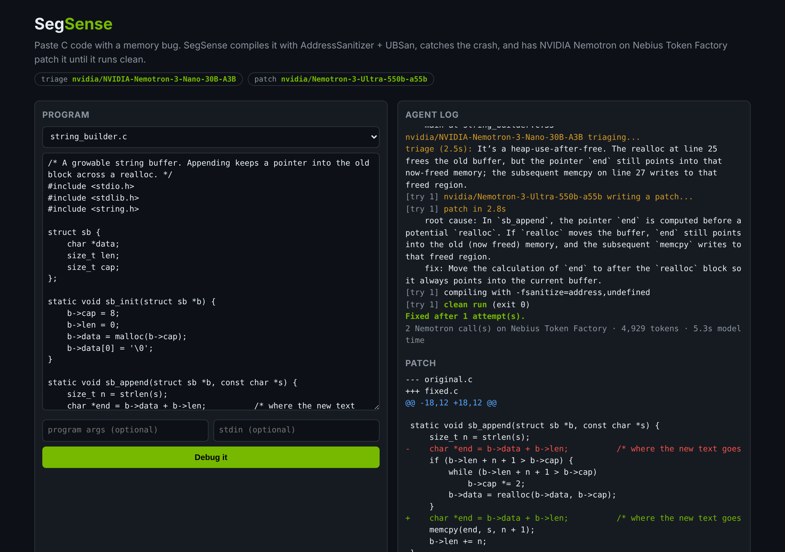

# SegSense

[](https://github.com/Blop77/SegSense/actions/workflows/tests.yml)
[](LICENSE)

**Agentic debugger for C memory bugs.** SegSense compiles your C program with AddressSanitizer and
UndefinedBehaviorSanitizer, runs it, catches the crash, and has **NVIDIA Nemotron on Nebius Token
Factory** write a patch. It re-compiles and re-tests every patch and loops until the program runs clean.

> Built for the **NVIDIA x Nebius Global AI Hackathon**, *Coding and Agentic Engineering* track.

```
$ segsense fix examples/heap_overflow.c
[orig] AddressSanitizer: heap-buffer-overflow  duplicate at heap_overflow.c:8
[segsense] triage: malloc(strlen(s)) leaves no room for the NUL; strcpy on line 8 writes past it.
[try 1] asking nvidia/Nemotron-3-Ultra-550b-a55b for a patch ...
[try 1] clean run (exit 0)

Fixed after 1 attempt(s).
-    char *copy = malloc(strlen(s));
+    char *copy = malloc(strlen(s) + 1);
```



Hackathon submission material (Devpost text, demo video script, feedback) is in [SUBMISSION.md](SUBMISSION.md).

## Why

Segfaults, use-after-free and buffer overflows are the bugs every C programmer, from students to
kernel developers, loses hours to. The sanitizers already pinpoint *where* memory went wrong.
SegSense hands that ground truth to a model that reasons about *why*, then checks the model's
answer with the same sanitizers. A patch counts as a fix only when the program actually runs
clean. The model's claim alone is not enough.

## How it works

```
             ┌─────────────────────────────────────────────────────────────┐
  prog.c ──▶ │ 1. build   gcc/clang -fsanitize=address,undefined -g -O0     │
             │ 2. run     capture ASan / UBSan / LeakSanitizer report       │
             │ 3. parse   bug kind, faulting line, alloc/free stacks        │
             │ 4. triage  Nemotron Nano: fast root-cause hint     (1 call)  │
             │ 5. patch   Nemotron Ultra: full corrected file + reasoning   │
             │ 6. verify  rebuild + rerun; failures fed back to step 5      │
             └──────────────────────────── loop until clean ───────────────┘
                                         │
                                         ▼
                         unified diff + root-cause explanation
```

- **Two NVIDIA models, each sized for its job.** A small, fast Nemotron triages the report in about
  a second. The large reasoning Nemotron writes the patch. This follows the hackathon advice: Ultra
  for serious reasoning, Nano for fast everyday calls.
- **Grounded prompts.** The model gets line-numbered source, the trimmed sanitizer report (the
  shadow-byte dump is removed) and the stack frames that point into the user's file.
- **Self-correcting.** When a patch doesn't compile, or still crashes, the compiler error or new
  report goes back to the model together with its earlier attempt.
- **No cheating.** The prompt forbids deleting the failing code. `--expect-stdout` also rejects any
  patch that changes the program's output, so a patch can't "fix" the program by gutting it.
- **Sandboxed runs.** CPU-time and file-size limits plus a timeout; the Docker image runs as a non-root user.

## Results on real Nemotron

All six bundled examples, run against Nebius Token Factory with Nemotron 3 Nano (triage) and
Nemotron 3 Ultra (patch). Each was fixed on the first attempt and verified clean by the sanitizers.
Each fix takes two Nemotron calls and about 4,000 to 5,000 tokens.

| Example | Bug | What Nemotron changed | Total time |
|---|---|---|---|
| `heap_overflow.c` | heap-buffer-overflow | `malloc(strlen(s))` → `malloc(strlen(s) + 1)` | 3 s |
| `use_after_free.c` | heap-use-after-free | saves `n->next` before `free(n)` | 5 s |
| `off_by_one.c` | stack-buffer-overflow | `i <= n` → `i < n` | 3 s |
| `double_free.c` | double-free | gives the second owner its own copy | 6 s |
| `memory_leak.c` | memory leak (Linux) | frees every word, the array and the temporary copy | 4 s |
| `signed_overflow.c` | signed integer overflow (UB) | widens `int` to `long long` and fixes `printf` | 6 s |
| `string_builder.c` | heap-use-after-free across `realloc` | computes the write pointer after `realloc` moves the buffer | 7 s |
| `matrix_transpose.c` | heap-buffer-overflow (wrong stride) | `t[c * cols + r]` → `t[c * rows + r]`; output checked with `--expect-stdout` | 6 s |

## NVIDIA and Nebius usage

| What | Where |
|---|---|
| **NVIDIA Nemotron 3 Ultra** (`nvidia/Nemotron-3-Ultra-550b-a55b`), the patch model: root-cause reasoning and code repair | `segsense/agent.py`, `SegSense._propose` |
| **NVIDIA Nemotron 3 Nano** (`nvidia/NVIDIA-Nemotron-3-Nano-30B-A3B`), the triage model: fast crash summary | `segsense/agent.py`, `SegSense._triage` |
| **Nebius Token Factory**: OpenAI-compatible inference for both models | `segsense/llm.py` |
| **Nebius Serverless Endpoints**: target for hosting the web demo from the `Dockerfile` (not yet deployed) | see *Deploy* |

Both models are NVIDIA open models served by Nebius Token Factory. Every AI call in SegSense goes to
one of them, and the CLI warns if you configure a model that isn't from NVIDIA.

### How Token Factory accelerated SegSense

- **Fast enough to sit inside an edit-compile-run loop.** On our runs, Nemotron 3 Ultra (550B)
  returned a complete patched file in 2–4 s and Nano triaged a crash in 1–4 s. Each full fix took
  3–7 s, so SegSense can afford to re-test every patch and retry instead of trusting one answer.
- **One endpoint, two model sizes.** Nano and Ultra sit behind the same API, so the "cheap model
  triages, strong model patches" split needed no extra infrastructure. Nano's triage note goes into
  Ultra's prompt.
- **No SDK lock-in.** Because the API is OpenAI-compatible, the whole client is about 100 lines of
  the Python standard library (`segsense/llm.py`), with nothing to install.
- **A live model catalogue.** `segsense models` reads Token Factory's `/models` endpoint. That is
  how we found and switched to the Nemotron 3 family during development.
- **Cheap per fix.** Each fix takes two calls and about 4–5k tokens, and the usage line printed after
  every run shows that.

## Setup

Requirements: Python 3.10+, and gcc or clang with the sanitizer runtime (`libasan`). Linux or
macOS. SegSense has no Python dependencies.

```bash
git clone https://github.com/Blop77/SegSense.git
cd SegSense
pip install -e .
export NEBIUS_API_KEY=...
segsense models
```

Get the key from https://tokenfactory.nebius.com. `segsense models` lists the NVIDIA models your key
can use. You can also skip installing and run `python3 -m segsense ...` from the repo folder.

The default model IDs live in `segsense/llm.py`. Token Factory's catalogue changes, so if
`segsense models` shows different IDs, set them explicitly:

```bash
export SEGSENSE_PATCH_MODEL=nvidia/<ultra-or-super-model-id>
export SEGSENSE_TRIAGE_MODEL=nvidia/<nano-model-id>
```

## Usage

```bash
segsense fix examples/use_after_free.c
segsense fix prog.c --args "input.txt 3" --stdin in.txt
segsense fix prog.c --expect-stdout expected.txt
segsense fix prog.c --in-place --max-attempts 6
segsense fix prog.c --no-triage
```

In order: fix an example (writes `examples/use_after_free.fixed.c`); run the program with arguments
and input; require the patch to keep the output identical; overwrite the file and allow more tries;
use only the patch model.

The exit code is `0` when the program ends up clean, so SegSense works in CI.

### Web demo

```bash
segsense serve --port 8080
```

Then open http://localhost:8080.

Choose an example or paste your own C code, then press **Debug it**. The agent log streams each step
(build, crash, Nemotron triage, patch, re-test) and the patch is shown as a coloured diff.

### Deploy

```bash
docker build -t segsense .
docker run -p 8080:8080 -e NEBIUS_API_KEY=$NEBIUS_API_KEY segsense
```

The same image can run on Nebius Serverless Endpoints or any container host. The demo compiles and
runs code that visitors submit, so keep it in an isolated container like this one. On a public URL,
also set `SEGSENSE_EXAMPLES_ONLY=1`; visitors can then run only the bundled examples, not their own code:

```bash
docker run -p 8080:8080 -e NEBIUS_API_KEY=$NEBIUS_API_KEY -e SEGSENSE_EXAMPLES_ONLY=1 segsense
```

## Tests

The tests run without an API key: a scripted stand-in replaces Nemotron, and the sanitizers and
compiler are real.

```bash
python -m unittest discover -s tests -t .
```

## Project layout

```
segsense/
  sanitizer.py   compile with sanitizers, run with limits, parse ASan/UBSan/LSan reports
  llm.py         Nebius Token Factory client (stdlib, retries, strips <think> blocks)
  agent.py       the triage → patch → verify loop
  cli.py         `segsense fix | models | serve`
  web.py         streaming web demo (single page, no build step)
examples/        buggy C programs for the demo
tests/           unit and end-to-end tests
```

## Limitations and next steps

- Works on one `.c` file at a time. Multi-file projects with a Makefile are next.
- Uses gcc's and clang's sanitizers, so it doesn't run on Windows/MSVC.
- Memory-leak detection (LeakSanitizer) is Linux-only. On macOS SegSense turns it off automatically,
  but still catches overflows, use-after-free, double free and undefined behaviour.
- Planned: Valgrind as a second opinion, and data races via ThreadSanitizer.

## License

[MIT](LICENSE)
